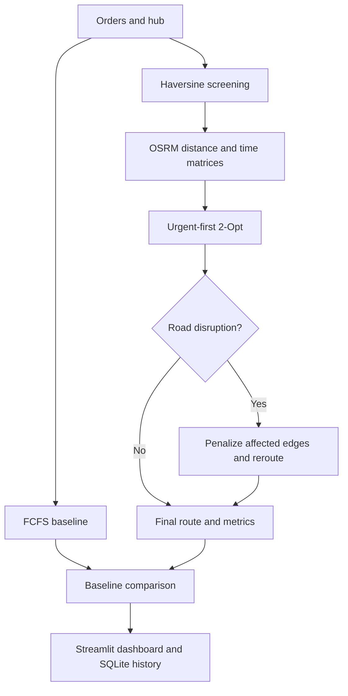

# Last-Mile Route Optimization

Live Demo: [https://gaoxanh-greenroute.streamlit.app](url)

A Streamlit-based decision-support application for planning greener last-mile delivery routes. The system compares a **First-Come, First-Served (FCFS)** baseline with a **2-Opt heuristic**, uses OSRM road-network distances, estimates CO₂ emissions, and demonstrates route adaptation under traffic and weather disruptions.

> Academic prototype: the current implementation focuses on a single delivery batch and one route at a time. It is not yet a production-grade multi-vehicle VRP solver.

## Highlights

- Compare FCFS and optimized delivery sequences.
- Build road-distance and travel-time matrices with the OSRM Table API.
- Keep a selected urgent order at the beginning of the optimized sequence.
- Re-optimize the untravelled part of a route when a bottleneck appears.
- Demonstrate traffic, weather, and combined disruption scenarios.
- Visualize routes, stops, hazards, distances, and CO₂ emissions.
- Manage orders and inspect saved route history in SQLite.
- Validate routing, distance, emission, and persistence logic with automated tests.

## System Workflow



## Optimization Approach

The application uses a transparent heuristic pipeline rather than an exact solver:

1. **FCFS baseline** — orders are sorted by `created_at` to form the reference route.
2. **Distance construction** — Haversine distance provides geographic screening, while OSRM supplies road distance and duration matrices.
3. **Urgent-order constraint** — the selected urgent order is fixed as the first delivery stop.
4. **2-Opt improvement** — contiguous route segments are reversed iteratively whenever the total road distance decreases.
5. **Disruption handling** — affected edges receive large penalties; the uncompleted suffix is optimized again, and OSRM waypoint detours are evaluated for hazard clearance.
6. **Environmental evaluation** — emissions are estimated as:

   ```text
   CO₂ (kg) = route distance (km) × emission factor (kg CO₂/km)
   ```

   The default motorcycle emission factor is `0.06 kg CO₂/km` and can be changed in `services/config.py`.

### Scenarios

| Scenario | Behaviour |
| --- | --- |
| `Normal` | Runs urgent-first 2-Opt without an active disruption. |
| `Traffic` | Applies a simulated traffic bottleneck to an early route leg. |
| `Weather` | Applies a simulated weather hazard to a later route leg. |
| `Both` | Activates both disruption types and recalculates the remaining route. |

## Application Pages

| Page | Purpose |
| --- | --- |
| Dashboard | Summarizes delivery distance, emissions, and recent route performance. |
| Optimization | Selects a batch, urgent order, and scenario; runs the routing workflow and displays route comparisons. |
| Orders | Filters orders by identifier, customer, status, and delivery batch; previews locations. |
| Route History | Reviews stored FCFS/optimized routes, KPIs, stops, and locations. |

## Technology Stack

- Python 3.12+
- Streamlit
- pandas
- PyDeck and Altair/Plotly visualizations
- SQLite
- OSRM APIs backed by OpenStreetMap road data
- pytest test suite

## Project Structure

```text
last-mile-route-optimization/
├── app.py                         # Streamlit entry point and shared UI
├── modules/                       # Dashboard, optimization, orders, history
├── services/
│   ├── fcfs.py                    # FCFS baseline construction
│   ├── emission.py                # CO₂ calculations
│   ├── orchestrator.py            # End-to-end routing workflow
│   └── routing/
│       ├── distance_matrix.py     # Haversine and OSRM matrices
│       ├── two_opt.py             # 2-Opt heuristic
│       ├── bottleneck.py          # Edge penalties and suffix rerouting
│       ├── road_routing.py        # OSRM geometry and detour logic
│       └── leg_distance.py        # Per-leg metrics
├── database/
│   ├── schema.sql                 # Relational schema
│   ├── connection.py              # SQLite connection and initialization
│   └── last_mile_co2.db           # Bundled demonstration database
├── data/                           # Sample orders and seed generator
├── tests/                          # Unit and integration-oriented checks
└── requirements.txt
```

## Getting Started

### Prerequisites

- Python 3.12 or newer
- Internet access for the default public OSRM endpoint
- Git

### Installation

```bash
git clone https://github.com/gaoxanh/last-mile-route-optimization.git
cd last-mile-route-optimization

python -m venv .venv
```

Activate the virtual environment:

```bash
# Windows PowerShell
.venv\Scripts\Activate.ps1

# macOS/Linux
source .venv/bin/activate
```

Install dependencies and start the application:

```bash
python -m pip install --upgrade pip
pip install -r requirements.txt
streamlit run app.py
```

Streamlit will print the local URL, typically `http://localhost:8501`.

## Configuration

The routing service reads these optional environment variables:

| Variable | Default | Description |
| --- | --- | --- |
| `OSRM_URL` | `https://router.project-osrm.org` | Base URL of the OSRM server. |
| `OSRM_TIMEOUT_SECONDS` | `20` | HTTP timeout for OSRM requests. |

Example:

```bash
export OSRM_URL="http://localhost:5000"
export OSRM_TIMEOUT_SECONDS="30"
streamlit run app.py
```

For reliable or high-volume use, run a dedicated OSRM instance instead of relying on the public demonstration server.

## Data and Database

The repository includes `data/sample_orders.csv` and a demonstration SQLite database. The relational model contains hubs, customers, vehicles, delivery batches, orders, routes, and route stops.

To initialize an empty database schema locally:

```bash
python -m database.connection
```

Back up `database/last_mile_co2.db` before replacing or reinitializing project data.

## Testing

Install the test runner and execute the suite:

```bash
pip install pytest
pytest -q
```

You can also run the project validation scripts individually, for example:

```bash
python tests/check_two_opt.py
python tests/check_emission.py
python tests/validate_core.py
```

Some routing operations require a reachable OSRM service. Tests that monkeypatch OSRM remain deterministic and do not depend on live route results.

## Current Limitations

- 2-Opt is a local-search heuristic and does not guarantee a globally optimal route.
- The current optimization page handles one batch/vehicle route rather than a full capacitated multi-vehicle VRP.
- Traffic and weather events are simulated scenarios, not live sensor or API feeds.
- Detours are constrained through penalties and intermediate waypoints because the public OSRM API does not expose dynamic road-closure editing.
- Emissions are estimated with a constant distance-based factor and do not yet model speed, load, idling, vehicle condition, or road grade.
- The bundled database and dashboard values are intended for demonstration and academic evaluation.

## Roadmap

- Add capacity-constrained multi-vehicle routing with OR-Tools.
- Integrate live traffic and weather data.
- Support time windows, driver shifts, and service times.
- Add authentication, role-based access, and audit logs.
- Replace constant emission factors with vehicle- and operating-condition models.
- Package reproducible benchmark datasets and CI workflows.

## Contributing

Contributions are welcome. Please create a focused branch, add or update tests, run the test suite, and open a pull request describing the problem and the proposed change.

## License

No license file is currently included. Unless the repository owner adds a license, the source remains under default copyright and should not be redistributed or reused beyond the permissions granted by GitHub and the owner.

## Acknowledgements

- [Streamlit](https://streamlit.io/) for the interactive application framework.
- [Project OSRM](https://project-osrm.org/) for road-network routing services.
- [OpenStreetMap](https://www.openstreetmap.org/) contributors for map and road data.

## Author

Developed by [gaoxanh](https://github.com/gaoxanh).
